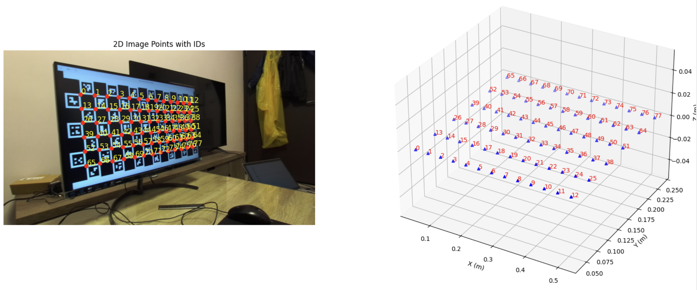
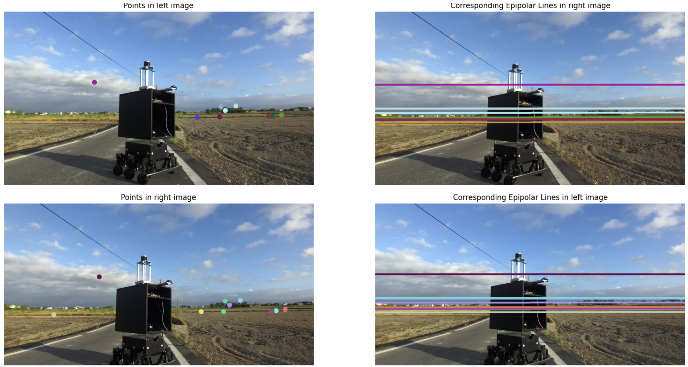
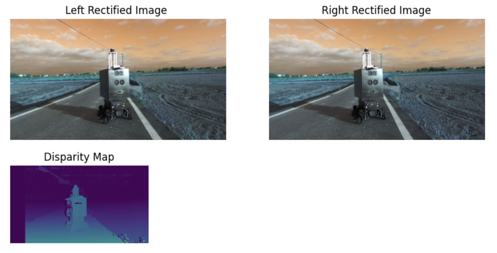

# advanced_calibration_starter
Repository for the module#2 of ThinkAutonomous' 3D Computer Vision program: https://www.thinkautonomous.ai/courses

This advanced workshop teaches camera calibration by focusing on its real-world impact on 3D reconstruction rather than just relying on simple automated functions.
It's going through epipolar geometry in stereo vision, demonstrating how to find and visualize corresponding points and lines between two camera views using calibration data to enable accurate 3D reconstruction.

Calibration:

Epipolar geometry:

Stereo reconstruction:

